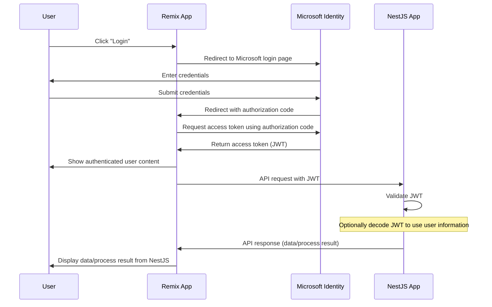

# remix-nestjs-sso-poc

## Flow


```mermaid
sequenceDiagram
    participant User as User
    participant Remix as Remix App
    participant MS as Microsoft Identity
    participant NestJS as NestJS App

    User->>Remix: Click "Login"
    Remix->>MS: Redirect to Microsoft login page
    MS->>User: Enter credentials
    User->>MS: Submit credentials
    MS->>Remix: Redirect with authorization code
    Remix->>MS: Request access token using authorization code
    MS->>Remix: Return access token (JWT)
    Remix->>User: Show authenticated user content
    Remix->>NestJS: API request with JWT
    NestJS->>NestJS: Validate JWT
    Note over NestJS: Optionally decode JWT to use user information
    NestJS->>Remix: API response (data/process result)
    Remix->>User: Display data/process result from NestJS
```

## Getting Started

To install dependencies:

```bash
bun install
```

To run:

```bash
bun run dev:remix
bun run dev:nestjs
```
