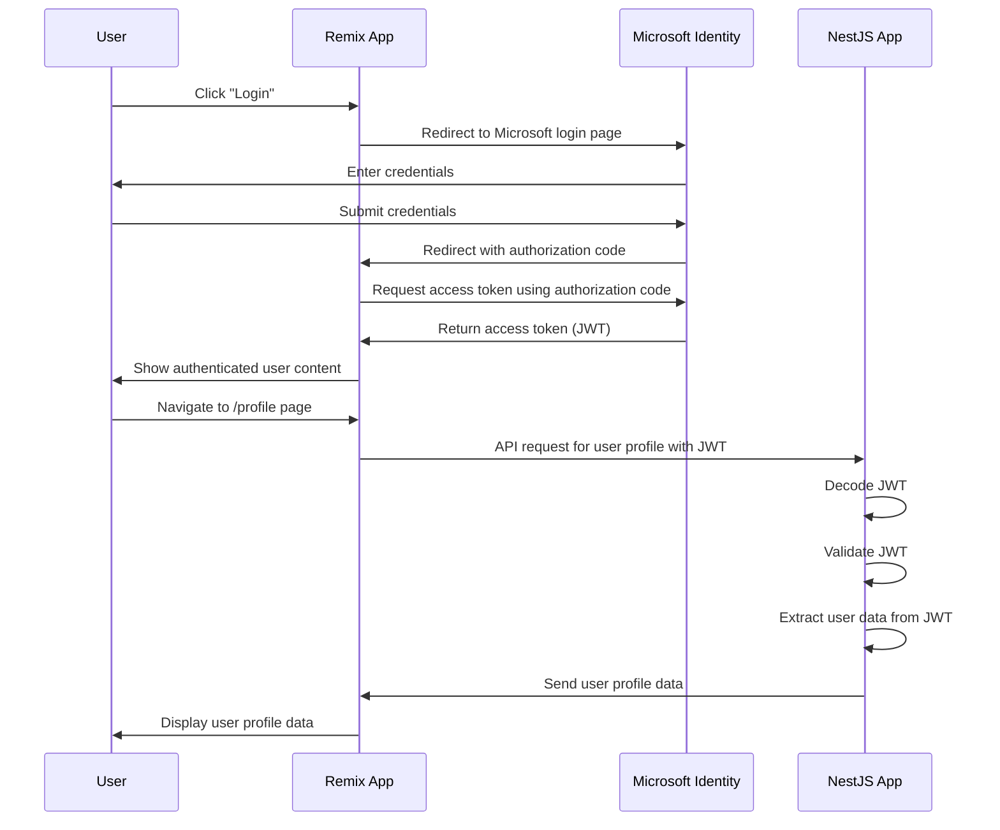

# Remix and NestJS Integration with Microsoft Identity Authentication

> [!IMPORTANT]
>
> This project uses simplified Express-based applications to imitate the behavior of Remix and NestJS frameworks. These
> are not actual implementations of Remix and NestJS but are designed to demonstrate the integration with Microsoft
> Identity.

## Authentication Flow Diagram



## Prerequisites

- Bun package manager
- A Microsoft Identity application setup with the required permissions and redirect URIs configured

## Getting Started

Install dependencies:

```bash
bun install
```

Copy the `.env.example` file to `.env` and fill in the required values:

```bash
cp .env.example .env
```

Run the applications:

```bash
bun run dev:remix
bun run dev:nestjs
```

## Usage

1. Start both applications using the instructions above.
2. Navigate to the Remix app in your web browser.
3. Click on "Login" to authenticate via Microsoft Identity.
4. After authentication, access the /profile page to fetch and display user profile data from NestJS.
